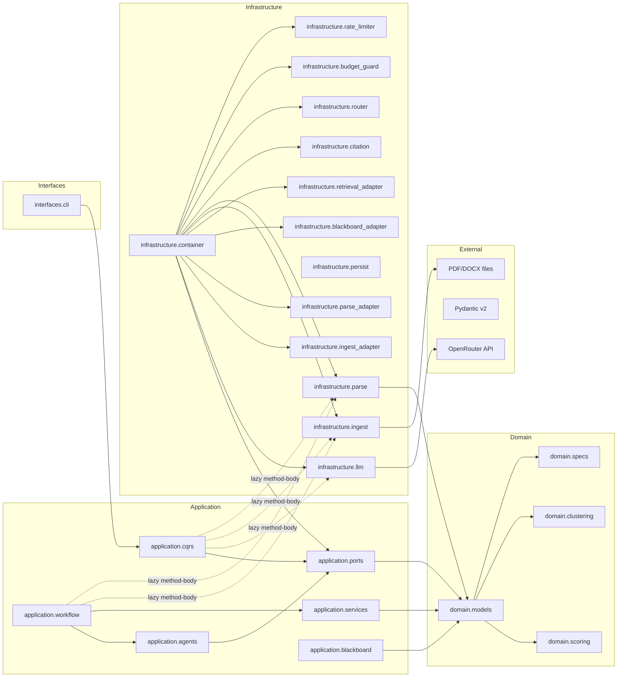

# ARCHITECTURE MINDMAP

## 1. SYSTEM IDENTITY

- **Primary Language:** Python 3.12 (detected: `pyproject.toml` `requires-python = ">=3.12"`, `target-version = "py312"`)
- **Frameworks:** Pydantic v2 (`pydantic>=2.0`), pydantic-settings v2 (`pydantic-settings>=2.0`), structlog, httpx, pytest 8.x
- **Architectural Style:** **Layered Clean / Hexagonal** with Event-Sourced Workflow DAG. Four strict layers (Domain → Application → Infrastructure → Interfaces) enforced by import-linter. Evidence: `pyproject.toml` `[[tool.import-linter.contract_types]]` with 11 forbidden-cross-layer import rules.
- **Entry Points:**
  - `interfaces/cli/__init__.py:entry_point()` — CLI entry via `leggie` console_scripts (`pyproject.toml` line 26)
  - `__main__.py` — fallback `python -m leggie` entry, delegates to `leggie.interfaces.cli`
  - `BillAnalysisFlow.run()` (`workflow/bill_analysis_flow.py:80`) — programmatic API entry
- **Build/Config Files:** `pyproject.toml` (ruff, mypy, pytest, coverage, import-linter), `setup.py`, `.pre-commit-config.yaml`, `Dockerfile` (multi-stage), `.gitignore`, `.env.example`, `config/routes.yaml`

---

## 2. MODULE INVENTORY

### `leggie/` — Package Root
- **Responsibility:** Verson, package identity
- **Type:** meta
- **Exports:** `__version__ = "0.1.0"`
- **Internal Structure:**
  - `__init__.py` — version string only
  - `__main__.py` — `from leggie.interfaces.cli import entry_point; entry_point()`

### `leggie/domain/` — Pure Functional Core
- **Responsibility:** Immutable entities, value objects, pure scoring/clustering logic, business rule specifications. Zero I/O, zero outer-layer imports.
- **Type:** core logic
- **Exports:** Article, Finding (IRAC), Evidence, Citation, Confidence, Event, Plan, LensTask; scoring functions; clustering functions; Specification pattern classes
- **Internal Structure:**
  - `domain/models/__init__.py` — 289 lines. 12 frozen Pydantic models: `Article`, `Paragraph`, `SubParagraph`, `Document`, `Finding` (IRAC-structured), `Evidence`, `Citation`, `Confidence`, `Event`, `Plan`, `LensTask`, plus 8 `StrEnum` types (FindingType, Severity, ConfidenceGrade, ModelTier, CitationScheme, WorkflowState, EventType). All frozen.
  - `domain/models/structured_output.py` — Pydantic DTOs for LLM response parsing: `IRACCandidate`, `LensFindings`, `VSCandidate`, `VSResponse`, `SkepticVerdictResponse`
  - `domain/scoring/__init__.py` — 64 lines. Pure functions: `score_severity()`, `score_novelty()`, `combine_confidence()`, `confidence_from_verification()`
  - `domain/clustering/__init__.py` — 93 lines. Pure functions: `cluster()`, `deduplicate()`, `merge_findings()`. Greedy O(n²) clustering with injected similarity function.
  - `domain/specs/__init__.py` — 116 lines. Specification pattern: `Spec[T]` ABC with `AndSpec`, `OrSpec`, `NotSpec` composition. Concrete: `FindingAdmissible`, `CitationResolves`, `MeetsSeverityThreshold`, `HasVerifiedCitations`
- **Dependencies:** → none (0 imports of `leggie.application`, `leggie.infrastructure`, or `leggie.interfaces`)
- **External:** `pydantic>=2.0`

### `leggie/application/ports/` — Abstract Interfaces (Hexagonal)
- **Responsibility:** 7 abstract ports defining boundaries between application logic and infrastructure adapters
- **Type:** interface / cross-cutting concern
- **Exports:** `LLMPort` (ABC with `generate`, `generate_structured`, `count_tokens`), `RouterPort` (`route`, `cascade`, `supported_models`), `RetrievalPort` (`search`, `get_document`, `corpus_stats`), `StatePort`, `EventBusPort`, `BlackboardPort`, `CitationParserPort`
- **Internal Structure:**
  - `ports/__init__.py` — re-exports all 7 ports
  - `ports/llm.py` — `LLMRequest`, `LLMResponse` frozen dataclasses (lines 12-47), `LLMPort` ABC (lines 50-80)
  - `ports/router.py` — `RouteResult` dataclass, `RouterPort` ABC
  - `ports/retrieval.py` — `RetrievalResult` dataclass, `RetrievalPort` ABC
  - `ports/state.py` — `StatePort` ABC
  - `ports/event_bus.py` — `EventBusPort` ABC, `EventHandler` type
  - `ports/blackboard.py` — `BlackboardEntry` dataclass, `BlackboardPort` ABC
  - `ports/citation_parser.py` — `CitationParserPort` ABC
  - `ports/ingest.py` — `IngestPort` ABC (FIX_PLAN G7)
  - `ports/parse.py` — `ParsePort` ABC (FIX_PLAN G7)
- **Dependencies:** → `leggie.domain.models` (all ports import domain models for request/response types)

### `leggie/application/cqrs/` — Command Query Responsibility Segregation
- **Responsibility:** Decouple command/query senders from handlers via Mediator pattern with middleware pipeline
- **Type:** core logic
- **Exports:** `Mediator` class, `Command`, `Query`, `CommandHandler`, `QueryHandler`, `IPipelineBehavior` ABCs
- **Internal Structure:**
  - `cqrs/base.py` — `Command(BaseModel)`, `Query(BaseModel)`, `CommandHandler(ABC, Generic)`, `QueryHandler(ABC, Generic)`, `CommandResult`, `QueryResult`, `IPipelineBehavior`
  - `cqrs/mediator.py` — `Mediator` with `register_command_handler`, `register_query_handler`, `add_pipeline_behavior`, `send()`, `query()`; pipeline chain built via `_run_pipeline()`
  - `cqrs/commands/cli_commands.py` — `ParseDocumentCommand`, `AnalyzeBillCommand`, `EvalGoldSetCommand` (all inherit `Command`)
  - `cqrs/handlers/cli_handlers.py` — `ParseDocumentHandler`, `AnalyzeBillHandler`, `EvalGoldSetHandler`; imports infrastructure internally (`IngestorFactory`, `DocumentParser`, `EvalScorer`, `LLMAdapter`)
- **Dependencies:** → `leggie.application.cqrs.base`, `leggie.domain.models`, `leggie.config.settings`, `leggie.infrastructure.*` (method-body imports, not module-level)

### `leggie/application/agents/` — Lens Workers, Skeptic, Improver, Orchestrator
- **Responsibility:** Strategy pattern lenses (5 legal perspectives), CalibratedSkeptic (Chain of Responsibility), ImprovementEngine (2 strategies), Orchestrator (worker dispatch)
- **Type:** core logic
- **Exports:** `ConstitutionalLens`, `EconomicLens`, `EUGDPRLens`, `ImplementationLens`, `LegalCoherenceLens`, `CalibratedSkeptic`, `ImprovementEngine`, `Orchestrator`, `Lens` ABC
- **Internal Structure:**
  - `agents/lens.py` — `Lens(ABC)` with `__init__(llm, model)`, `_call_llm_structured()`, `_prompt_for()`
  - `agents/constitutional_lens.py` — 194 lines. `ConstitutionalLens(Lens)`: LLM-first `analyze()` with regex fallback. 4 pattern categories (delegation, retroactive, rights, procedure). Quote validation via `cove_verifier._normalize()`.
  - `agents/economic_lens.py` — 84 lines. `EconomicLens`: cost + admin burden patterns
  - `agents/eu_gdpr_lens.py` — 85 lines. `EUGDPRLens`: GDPR + EU directive patterns
  - `agents/implementation_lens.py` — 84 lines. `ImplementationLens`: deadline + transition patterns
  - `agents/legal_coherence_lens.py` — 80 lines. `LegalCoherenceLens`: vague + contradiction patterns
  - `agents/orchestrator.py` — 133 lines. Deterministic article→lens task decomposition. Parallel dispatch via `asyncio.TaskGroup` + `Semaphore(10)`. Injects LLMPort into each lens via constructor.
  - `agents/skeptic.py` — 176 lines. `CalibratedSkeptic` with 4 typed `SkepticGate` subclasses (Numeric, Temporal, Factual, Obligation) in Chain of Responsibility. Async `examine()` -> survivor/drop logic.
  - `agents/improver.py` — 130 lines. `ImprovementEngine` with `MinimalChangeStrategy` + `ReformStrategy`. One-shot suggestion generation per O2.
  - `agents/prompts/constitutional.py` — System prompt + user prompt template for LLM constitutional lens
- **Dependencies:** → `leggie.application.ports.llm`, `leggie.domain.models`, `leggie.domain.models.structured_output`
- **External:** `asyncio`

### `leggie/application/workflow/` — State Machine + Stage Lifecycle + Flow
- **Responsibility:** Bill analysis orchestration via pure FSM + Template Method stages
- **Type:** core logic
- **Exports:** `FlowStateMachine`, `Stage` ABC, `StageContext`, `BillAnalysisFlow`
- **Internal Structure:**
  - `workflow/flow_state_machine.py` — 80 lines. Pure transition-table FSM: `_TRANSITION_TABLE` dict with 18 pairs mapping `(WorkflowState, event) → next`. Static methods: `transition()`, `can_transition()`, `valid_events_for()`, `terminal_states()`.
  - `workflow/stage.py` — 88 lines. `Stage(ABC)` with Template Method `run()` → `_plan()` → `_execute()` → `_aggregate()` → `_verify()`. `StageContext`, `StageResult`.
  - `workflow/bill_analysis_flow.py` — 202 lines. `BillAnalysisFlow`: assembles the full pipeline. Accepts `LLMPort`, `IngestPort`, `ParsePort` via constructor. `run(file_path)` → 10-stage sequence through FSM with event logging, Sceptic review, CoVe verification, improvement, report rendering, and auto-save to `Outputs/`.
- **Dependencies:** → `leggie.application.agents.*`, `leggie.application.services.*`, `leggie.application.workflow.*`, `leggie.domain.models`, `leggie.infrastructure.*` (lazy method-body imports)

### `leggie/application/services/` — VS, CoVe, Rerank, Reports
- **Responsibility:** Algorithmic services: Verbalized Sampling, Chain-of-Verification, composite reranking, report rendering
- **Type:** core logic
- **Exports:** `VerbalizedSampling` ABC, `CoVeVerifier`, `CompositeReranker`, `ExecutiveSummaryRenderer`, `ArticleByArticleRenderer`, `Report`
- **Internal Structure:**
  - `services/verbalized_sampling.py` — Template Method: `build_prompt`→`call_model`→`parse_distribution`→`sample_tail`. ABC with fake implementation for testing.
  - `services/cove_verifier.py` — `CoVeVerifier`: plan verification questions from citations → execute independently (factored via citation parser) → compile result. `validate_quote()` for substring check.
  - `services/rerank.py` — `CompositeReranker`: `score(finding, all_findings)` → severity×0.4 + confidence×0.4 + novelty×0.2. `_compute_novelty()` via keyword overlap.
  - `services/reports.py` — `ReportRenderer(ABC)` with Template Method `render()` → `build_title`→`build_metadata`→`build_body`. Two concrete renderers: `ExecutiveSummaryRenderer` (overview + severity grouping + recommendations), `ArticleByArticleRenderer` (per-article with IRAC + evidence + suggestions).
- **Dependencies:** → `leggie.domain.models`, `leggie.application.agents.improver`

### `leggie/application/blackboard/` — Aggregation Substrate
- **Responsibility:** Schema-grounded, append-only finding aggregation with Observer pattern
- **Type:** core logic
- **Exports:** `Blackboard`, `BlackboardEntry`, `BlackboardRound`, `ObserverCallback`
- **Internal Structure:**
  - `blackboard/__init__.py` — 116 lines. `Blackboard` class: `post(finding, agent_id)` → append to current round → notify observers. `subscribe()`, `unsubscribe()`, `next_round()`, `get_all_findings()`, `get_entries_by_agent()`. Round management with adaptive stop.
- **Dependencies:** → `leggie.domain.models`

### `leggie/config/` — Settings
- **Responsibility:** 12-factor configuration via `pydantic-settings`
- **Type:** cross-cutting concern
- **Exports:** `Settings`, `LLMSettings`, `CascadeSettings`, `BudgetSettings`, `RetrievalSettings`, `IngestSettings`, `PersistenceSettings`, `get_settings()`, `reload_settings()`
- **Internal Structure:**
  - `config/settings.py` — 143 lines. 7 Pydantic settings classes. `LLMSettings` with `openrouter_api_key`. `CascadeSettings` with free/budget/premium model IDs. `BudgetSettings` with max_tokens_per_run/max_cost_per_run. Global singleton pattern.
- **Dependencies:** → `pydantic-settings>=2.0`

### `leggie/infrastructure/` — Adapters, Repositories, Resilience
- **Responsibility:** All I/O, external API calls, persistence, LLM, and infrastructure concerns. Implements application ports.
- **Type:** infrastructure
- **Exports:** `LLMAdapter`, `OpenRouterProvider`, `StaticRouter`, `DocumentParser`, `GreekCitationParser`, `BudgetGuard`, `IngestorFactory`, `InMemoryEventBus`, `JsonEventStore`, `BlackboardAdapter`, `SimpleRetrievalAdapter`, `IngestAdapter`, `ParseAdapter`, `CheckpointStore`, `CascadeTracker`, `RateLimiter`
- **Internal Structure:**
  - `infrastructure/llm/`:
    - `llm/__init__.py` — 50 lines. `LLMAdapter` class: wraps `OpenRouterProvider`, delegates generate/generate_structured/count_tokens
    - `llm/base.py` — `BaseLLMProvider(ABC)`, `LLMError`, `LLMConfigurationError`, `LLMTimeoutError`, `LLMRateLimitError`, `BudgetExceededError`
    - `llm/adapters/openrouter.py` — `OpenRouterProvider`: OpenAI-compatible API at `openrouter.ai/api/v1`. Sends `transforms: ["cache"]` for prompt caching, `include_reasoning` for thinking models, `response_format` for structured output. Rate-limited via injected `RateLimiter`. Retry via `@with_retry()` decorator.
    - `llm/decorators.py` — `with_retry(max_retries=3, base_delay=1.0)`, `with_cache(max_size=100)`
  - `infrastructure/budget_guard/__init__.py` — `BudgetGuard`: token/$ ceiling with degrade strategies. `save_state()`/`load_state()`/`to_file()`/`from_file()` for checkpointing.
  - `infrastructure/citation/__init__.py` — `GreekCitationParser`: deterministic regex-based extraction of ΦΕΚ/CELEX/ECLI citations. `resolve()` against resolution index.
  - `infrastructure/parse/__init__.py` — `DocumentParser`: line-anchored article extraction, cross-ref stop-list, monotonic sequence guard, PDF newline repair (FIX_PLAN F0).
  - `infrastructure/ingest/__init__.py` — `IngestorFactory` + `PDFIngestor`/`DOCXIngestor`/`HTMLIngestor`/`TextIngestor` (Factory pattern)
  - `infrastructure/persistence/__init__.py` — `InMemoryEventBus` + `JsonEventStore` (JSONL-serialized events)
  - `infrastructure/persistence/eval_harness.py` — 236 lines. `GoldSet` (load/save JSON gold labels), `EvalScorer` (U3 typed metrics + Risk Direction Index)
  - `infrastructure/persistence/checkpoint_store.py` — `CheckpointStore`: atomic file writes via `.tmp` → rename
  - `infrastructure/router/__init__.py` — `StaticRouter`: YAML rules table → cascade CoR (FREE→BUDGET→PREMIUM)
  - `infrastructure/router/cascade_tracker.py` — `CascadeTracker`: telemetry per cascade decision
  - `infrastructure/container.py` — DI composition root: `Container` class with `register`/`register_instance`/`get`/`configure_defaults()`
  - `infrastructure/observability/__init__.py` — structlog configuration, `Timer` context manager, `trace_id` ContextVar propagation
  - `infrastructure/rate_limiter.py` — `RateLimiter`: token-bucket with `asyncio.Lock`, `acquire()` interface
  - `infrastructure/blackboard_adapter.py` — `BlackboardAdapter(BlackboardPort)`: wraps `application/blackboard/Blackboard`
  - `infrastructure/retrieval_adapter.py` — `SimpleRetrievalAdapter(RetrievalPort)`: file-based search stub
  - `infrastructure/ingest_adapter.py` — `IngestAdapter(IngestPort)`: delegates to `IngestorFactory`
  - `infrastructure/parse_adapter.py` — `ParseAdapter(ParsePort)`: delegates to `DocumentParser`

### `leggie/interfaces/` — CLI
- **Responsibility:** Thin CLI entry point. Dispatches to CQRS mediator. No direct infrastructure imports.
- **Type:** interface
- **Exports:** `build_parser()`, `entry_point()`
- **Internal Structure:**
  - `interfaces/cli/__init__.py` — 172 lines. `argparse`-based CLI with 3 subcommands: `parse`, `analyze`, `eval`. `_build_mediator()` registers 3 command handlers. `main()` dispatches via mediator.
  - `interfaces/__init__.py` — empty
- **Dependencies:** → `leggie.application.cqrs.mediator`, `leggie.application.cqrs.commands.cli_commands`, `leggie.application.cqrs.handlers.cli_handlers`

---

## 3. DEPENDENCY GRAPH (Mermaid)

---

## 4. DATA FLOW — TOP 3 CRITICAL PATHS

### Path 1: Bill Analysis (primary user flow)
- **Sequence:** `CLI: leggie analyze bill.pdf` → `interfaces/cli:entry_point()` → `_handle_analyze()` → `Mediator.send(AnalyzeBillCommand)` → `AnalyzeBillHandler.handle()` → `BillAnalysisFlow.run(bill.pdf)` → `Orchestrator.analyze_document()` → 5 parallel lens workers → `CalibratedSkeptic.review()` → `CoVeVerifier.verify_batch()` → `CompositeReranker.rerank()` → `ImprovementEngine.generate_suggestions()` → `ExecutiveSummaryRenderer.render()` + `ArticleByArticleRenderer.render()` → auto-save to `Outputs/`
- **State Changes:** `Event` objects appended to `BillAnalysisFlow._events` at each of 10+ stage transitions. `self._findings` reassigned after dedup → skeptic → CoVe → rerank (rerank runs last so the published order reflects post-verification confidence). Reports written to filesystem at `Outputs/{bill_name}_{type}.md`.
- **Failure Modes:**
  - Stage 1 (ingest): missing file → `IngestError` → FSM transitions to `FAILED`
  - Stage 4 (execute): lens exception → `Orchestrator._run_lens()` catches, logs warning, returns `[]` (FIX_PLAN G3)
  - Stage 6 (skeptic): gate exception → propagates up
  - Stage 7 (CoVe): citation parser failure → unverified citations flagged, flow continues
  - No global try/except at `BillAnalysisFlow.run()` level — exceptions propagate to handler level where they're caught and returned as `CommandResult(success=False, error=...)`
- **Observability Gap:** `CLI: entry_point()` at line 153 — `asyncio.run(main())` has no structured logging; only exit code. `AnalyzeBillHandler.handle()` catches `Exception` generically with no specific error typing.

### Path 2: CLI Eval (regression scoring)
- **Sequence:** `CLI: leggie eval --gold-set gold.json` → `Mediator.send(EvalGoldSetCommand)` → `EvalGoldSetHandler.handle()` → `GoldSet.load()` → for each bill_id: try `BillAnalysisFlow.run(bill_file)` (if found + LLM available) else `scorer.score(bill_id, [])` → `EvalScorer.score()` → return `EvalResult.to_dict()`
- **State Changes:** Gold set loaded from JSON into memory. Evaluation results written to file if `--results` specified. No persistent state mutation.
- **Failure Modes:** Missing gold-set file → `FileNotFoundError` → caught by handler → `CommandResult(success=False)`. Bill file not found for gold label → falls back to empty findings (silent).
- **Observability Gap:** Lines 99-108 in `cli_handlers.py`: no per-bill logging of whether LLM was used or fallback to empty.

### Path 3: Parser-only (preprocessing)
- **Sequence:** `CLI: leggie parse bill.pdf -o out.json` → `Mediator.send(ParseDocumentCommand)` → `ParseDocumentHandler.handle()` → `IngestorFactory.ingest()` → `DocumentParser.parse()` → JSON output → file write
- **State Changes:** PDF bytes → text → structured `Document` with articles/paragraphs → JSON on filesystem
- **Failure Modes:** Unsupported format → `UnsupportedFormatError` → handler catches → `CommandResult(success=False)`. PDF parsing error → `IngestError` → propagated.
- **Observability Gap:** No structured logging in `ParseDocumentHandler` — errors only caught generically at line 55.

---

## 5. DESIGN PATTERNS & DECISIONS

| Pattern | Evidence (file:line) | Confidence | Rationale |
|---------|----------------------|------------|-----------|
| **Ports & Adapters (Hexagonal)** | `application/ports/llm.py:50-80` — `LLMPort` ABC; `infrastructure/llm/adapters/openrouter.py` — `OpenRouterProvider` implements it | CONFIRMED | 7 ABCs in `ports/`, concrete adapters in `infrastructure/`. |
| **CQRS + Mediator** | `application/cqrs/mediator.py:33` — `Mediator` class with `send()`/`query()`; `application/cqrs/commands/` + `handlers/` | CONFIRMED | CLI dispatches commands through mediator; pipeline behaviors stackable. |
| **Strategy** | `application/agents/lens.py:16` — `Lens(ABC)` with `analyze()`; 5 concrete lenses; `improver.py:17` — `ImprovementStrategy(ABC)` with 2 impls; `services/rerank.py:34` — `Reranker(ABC)` | CONFIRMED | Lenses interchangeable; `Orchestrator` selects by name from config dict at `orchestrator.py:25`. |
| **Chain of Responsibility** | `agents/skeptic.py:42` — `SkepticGate(ABC)` with 4 typed subclasses; `CalibratedSkeptic.review()` runs each finding through all gates | CONFIRMED | Gates are independent, pass-or-flag; each `examine()` returns typed verdict. |
| **State (FSM)** | `workflow/flow_state_machine.py:23` — `_TRANSITION_TABLE` dict with 18 `(status, event)→next` pairs | CONFIRMED | Pure lookup table, no side effects, static methods. |
| **Template Method** | `workflow/stage.py:28` — `Stage.run()` calls `_plan()`→`_execute()`→`_aggregate()`→`_verify()`; `services/reports.py:50` — `ReportRenderer.render()` calls `_build_title()`→`_build_metadata()`→`_build_body()` | CONFIRMED | Fixed skeleton, subclasses override hooks. |
| **Event Sourcing** | `domain/models/__init__.py:280` — `Event` (frozen); `infrastructure/persistence/__init__.py` — `InMemoryEventBus` + `JsonEventStore` | CONFIRMED | `BillAnalysisFlow` records events at every stage transition; JSONL append-only store. |
| **Specification** | `domain/specs/__init__.py:17` — `Spec(ABC, Generic[T])` with `AndSpec`/`OrSpec`/`NotSpec` | CONFIRMED | Composable: `FindingAdmissible() & MeetsSeverityThreshold("high")`. |
| **Builder** | `domain/models/__init__.py` — frozen Pydantic models built via constructor; `services/reports.py` — `Report` assembled section by section | CONFIRMED | Reports built via `to_markdown()` combining sections. |
| **Composite** | `domain/models/__init__.py` — `Document→Article→Paragraph→SubParagraph` tree; `infrastructure/parse/__init__.py` builds it | CONFIRMED | Tree traversal for per-article report generation. |
| **Factory** | `infrastructure/ingest/__init__.py:28` — `IngestorFactory` with format registration + `get_ingestor(suffix)` | CONFIRMED | New format = register class + suffix. |
| **Decorator** | `infrastructure/llm/decorators.py:16` — `with_retry()`, `with_cache()` | CONFIRMED | Wraps async functions; `@with_retry()` on `OpenRouterProvider.generate()`. |
| **Circuit Breaker + Token Bucket** | `infrastructure/budget_guard/__init__.py` — `BudgetGuard`; `infrastructure/rate_limiter.py` — `RateLimiter` | CONFIRMED | Budget guard checks token/$ ceiling; rate limiter serializes calls at 5 RPS. |
| **Blackboard + Observer** | `application/blackboard/__init__.py:62` — `post()` calls all registered `ObserverCallback` entries | CONFIRMED | Append-only entries; Observer callback list notified on each post. |
| **DI Container** | `infrastructure/container.py:29` — `Container` with `register()`/`get()`/`configure_defaults()` | CONFIRMED | Service locator pattern; lazy `Callable` factories; singleton caching. |

---

## 6. ENTITY MAP

| Entity | Key Fields | Defined In | Consumed By | Persistence |
|--------|------------|------------|-------------|-------------|
| `Finding` | id:UUID, finding_type:FindingType, irac:IRAC, severity:Severity, confidence:Confidence, evidence:list[Evidence], lens:str, model:str, prompt_hash:str, seed:int | `domain/models/__init__.py:157` | All lenses, Skeptic, CoVe, Reranker, Reports, BillAnalysisFlow | in-memory (per run); serialized to JSON in `Outputs/*_findings.json` |
| `Article` | id:str, title:str, paragraphs:list[Paragraph], raw_text:str | `domain/models/__init__.py:97` | 5 lenses, Orchestrator, CoVe (quote validation), Reports | in-memory (parsed per run) |
| `Document` | title:str, document_id:str, source_format:str, articles:list[Article], preamble:str, raw_text:str | `domain/models/__init__.py:117` | BillAnalysisFlow, Reports, Orchestrator | in-memory |
| `Citation` | scheme:CitesScheme, identifier:str, original_text:str, resolved:bool, resolution_evidence:str | `domain/models/__init__.py:73` | Evidence, CoVeVerifier, CitationParser | in-memory; resolution index in `GreekCitationParser._resolution_index` |
| `Confidence` | score:float, grade:ConfidenceGrade, calibration_provenance:str | `domain/models/__init__.py:43` | Every Finding, Reranker, Skeptic, CoVe | in-memory |
| `Event` | event_type:EventType, aggregate_id:str, data:dict, timestamp:datetime, version:int | `domain/models/__init__.py:281` | InMemoryEventBus, JsonEventStore, BillAnalysisFlow | `Infrastructure/persistence/` JSONL append-only |
| `Report` | title:str, report_type:str, sections:list[dict], metadata:dict | `application/services/reports.py:23` | BillAnalysisFlow → `Outputs/*.md` | filesystem (Markdown) |
| `Suggestion` | finding_id:str, article_id:str, suggestion_type:str, description:str, proposed_change:str, priority:str | `application/agents/improver.py:13` | Reports, BillAnalysisFlow | in-memory → rendered into reports |
| `BlackboardEntry` | finding:Finding, agent_id:str, round_number:int, posted_at:datetime, metadata:dict | `application/blackboard/__init__.py:8` | Blackboard observers (Skeptic, dedup, rerank) | in-memory |
| `GoldLabel` | article_id:str, finding_type:FindingType, description:str, severity:Severity, citation_text:str | `infrastructure/persistence/eval_harness.py:15` | GoldSet, EvalScorer | filesystem (JSON in `tests/eval/`) |

---

## 7. RISK REGISTER

| Risk | Severity | Location | Evidence |
|------|----------|----------|----------|
| **LLM adapter untested in unit tests** — `LLMAdapter`, `OpenRouterProvider` have no mocked-HTTP tests verifying API response parsing, error handling, or rate limiter integration | MEDIUM | `infrastructure/llm/` (all files), `tests/unit/infrastructure/` | 0 unit tests exist for `LLMAdapter.generate()`, `generate_structured()`, or `OpenRouterProvider`. Test coverage for the 356-line module is 0. |
| **No rate-limit integration with CI** — RateLimiter exists but budget guard is not enforced on the real analysis path; `BillAnalysisFlow` uses `Orchestrator` directly without checking budget guard | MEDIUM | `workflow/bill_analysis_flow.py:52-58`, `orchestrator.py:55` | `BillAnalysisFlow.__init__()` creates `Orchestrator()` without budget guard awareness. Budget guard exists in `infrastructure/budget_guard/` but is not wired into the analysis pipeline. |
| **Event store not persisted across runs** — `InMemoryEventBus` loses events on process restart; `JsonEventStore` is configured but not connected to `BillAnalysisFlow` | MEDIUM | `workflow/bill_analysis_flow.py:190-200`, `infrastructure/persistence/__init__.py` | `BillAnalysisFlow._record_event()` appends to `self._events` list in memory only. `JsonEventStore.append()` exists but is never called. |
| **Skeptic drops findings without recording** — refuted findings are silently dropped; no refutation event is emitted for audit | MEDIUM | `application/agents/skeptic.py:85-87` | `if refuted: continue` — finding is simply not added to survivors. No event, no counter_evidence recorded on parent finding. |
| **ConstitutionalLens constructor path diverged from Lens ABC** — `ConstitutionalLens.__init__` sets `self._llm` and `self._model` directly instead of calling `super().__init__()` | LOW | `application/agents/constitutional_lens.py:23-24` | `ConstitutionalLens.__init__` sets fields directly; `Lens.__init__` at `lens.py:23` also sets same fields. Works because both do the same thing, but violates DRY. |
| **Economic/Implementation/EU lenses still pure regex** — FIX_PLAN F1 only upgraded ConstitutionalLens to LLM | LOW | `agents/economic_lens.py`, `implementation_lens.py`, `eu_gdpr_lens.py`, `legal_coherence_lens.py` | All 4 lenses contain only `_analyze_regex()` equivalent; no `_llm` path. Their findings will be low-quality regex stubs when used. |

---

## 8. UNCERTAINTY LOG

| Question | Location | Possible Interpretations | Impact if Wrong |
|----------|----------|--------------------------|-----------------|
| Does `LLMAdapter.generate_structured` correctly parse all OpenRouter response formats? | `infrastructure/llm/__init__.py:43-56` | (A) Works for models returning `{"findings": [...]}` but not variants like `{"result": {"findings": [...]}}` (B) Handles all JSON-format responses | F1 LLM integration would silently fall back to regex on malformed responses |
| Is `import-linter` CI-gated? | `pyproject.toml:82-123` | (A) Import-linter config exists but is not run in CI workflow (`.github/workflows/ci.yml` only runs pytest + ruff + mypy) (B) Import-linter runs as pre-commit hook | Layer violations could accumulate without detection |
| Are the 4 remaining regex-only lenses intended for LLM upgrade? | `agents/economic_lens.py`, `implementation_lens.py`, `eu_gdpr_lens.py`, `legal_coherence_lens.py` | (A) FIX_PLAN F1 intentionally scoped to ConstitutionalLens only; others deferred to follow-up (B) These 4 lenses should mirror ConstitutionalLens's LLM-first pattern but weren't updated | Analysis quality gap between constitutional and other lenses |
| Does `BudgetGuard` enforce on the `Orchestrator` path? | `infrastructure/budget_guard/__init__.py`, `orchestrator.py` | (A) Budget guard is registered in container but never integrated into the lens dispatch loop (B) Budget guard is intended to work as a port decorator wrapper | Cost overruns on large bills; degrade strategy never triggers |

**Truncation note:** 69 `leggie/` source files + 21 test files (not covered in this reconstruction to stay within context). Tests follow the module structure (unit tests in `tests/unit/` mirroring `leggie/`), integration tests in `tests/integration/`. Test files not individually inventoried.
