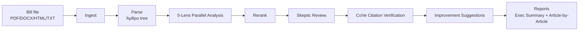

# Leggie — Greek Legal Bill Analyzer

> **Deterministic, event-sourced, LLM-powered legal analysis for Greek legislation.**
>
> Analyzes Greek bills through 5 independent legal perspectives, verifies every citation, and generates executive summaries and article-by-article reports — all on a Clean Architecture foundation with full auditability.

[](https://github.com/)
[](https://python.org)
[](https://github.com/)
[](LICENSE)

---

## How It Works



**5 legal lenses** analyze every article in parallel:

| Lens | What it checks |
|---|---|
| **Constitutional** | Delegation limits, retroactive effect, fundamental rights, procedure (Άρθρα 1–120 Συντάγματος) |
| **Legal-coherence** | Vague language, internal contradictions, undefined terminology |
| **Economic** | Fiscal impact, unfunded mandates, disproportionate penalties |
| **Implementation** | Unrealistic deadlines, missing transitional provisions, delegation gaps |
| **EU & GDPR** | EU directive transposition, GDPR compliance, cross-border data flows |

**Credibility pipeline** — every finding survives a gauntlet:
1. **Calibrated Skeptic** — 4 typed gates (Numeric, Temporal, Factual, Obligation) run adversarial review
2. **CoVe evidence loop** — Chain-of-Verification resolves every citation against the deterministic parser (ΦΕΚ/CELEX/ECLI)
3. **Reranker** — composite score (severity × confidence × novelty) orders output

---

## Quick Start

### Prerequisites
- Python 3.12+
- Optional: `LEGGIE_LLM__OPENROUTER_API_KEY` for LLM-powered analysis
  - Without an API key, analysis falls back to pattern-based (regex) lenses where available
  - Reranking defaults to `composite` (scoring-based, no model needed)
  - See [.env.example](.env.example) for all configuration options

### Installation

```bash
git clone <repo-url> leggie
cd leggie
pip install -e ".[dev]"
```

### CLI

```bash
# Parse a bill to JSON
leggie parse bill.txt

# Analyze a bill (runs all 5 lenses)
leggie analyze bill.txt

# Evaluate against a gold set
leggie eval --gold-set tests/eval/gold_set_sample.json

# Show version
leggie --version
```

### Deliberative pipeline (opt-in)

Leggie's default `analyze` is the deterministic 5-lens pipeline above. A second,
**explicitly opt-in** pipeline delegates multi-model deliberation to
[Reasoner](#) — a separate service that runs an 8-phase, cross-lab
generate-critique-synthesize engine — for a two-stage prose report:

1. **Stage 1 (generation)** — a structured report (introduction, summary,
   changes per Μέρος/Κεφάλαιο, purpose/provisions/consequences) plus a
   party-perspective evaluation.
2. **Stage 2 (adversarial audit)** — an independent auditor pass that
   consumes Stage 1's output and the full bill, surfacing what was missed:
   ambiguities, constitutional/EU-ECHR conflicts, loopholes, a Top-20 problem
   ranking, Top-10 amendments, and a 2-page executive briefing.

This pipeline is **non-deterministic and billable**, so it never runs unless
explicitly enabled:

```bash
# .env
LEGGIE_REASONER__ENABLED=true
LEGGIE_REASONER__HOME=/path/to/reasoner/repo   # for auto-start
LEGGIE_REASONER__API_KEY=...                   # Reasoner ADMIN_API_KEY

leggie analyze bill.txt --pipeline deliberative --perspective neutral
```

Output is a **prose Markdown report** (`Outputs/{bill}_deliberative.md`) with
three sections — Περίληψη, Κριτική (Stage 1), Έλεγχος/Audit (Stage 2) — plus
an optional citation appendix. It does **not** produce `Finding` objects and
does not go through Skeptic/CoVe verification; the deterministic `analyze`
path remains the source of truth for verified findings.

If Reasoner is unreachable, `analyze --pipeline deliberative` aborts with an
actionable message by default. Pass `--fallback` to run the deterministic
pipeline instead. See `.env.example` for all `LEGGIE_REASONER__*` settings.

### Python API

```python
import asyncio
from leggie.application.workflow.bill_analysis_flow import BillAnalysisFlow

async def main():
    flow = BillAnalysisFlow()
    findings, reports = await flow.run("path/to/bill.txt")

    # Access findings (IRAC-structured)
    for f in findings:
        print(f"{f.finding_type.value}: {f.irac.issue}")

    # Render reports
    for report in reports:
        print(report.to_markdown())

asyncio.run(main())
```

---

## Architecture

Leggie follows **Clean / Hexagonal Architecture** with strict layer enforcement:

```
leggie/
├── domain/           # Pure functional core — frozen Pydantic models, pure scoring/clustering
│   ├── models/       # Article, Finding (IRAC), Evidence, Citation, Event, Plan
│   ├── scoring/      # Severity, novelty, confidence calculation
│   ├── clustering/   # Dedup, cross-article merging
│   └── specs/        # Composable business rules (Specification pattern)
├── application/      # Use-cases, workflow, orchestration
│   ├── ports/        # 8 abstract interfaces (LLM, Router, Retrieval, State, EventBus, Blackboard, CitationParser, Reasoner)
│   ├── workflow/     # FlowStateMachine + BillAnalysisFlow + Stage lifecycle
│   ├── agents/       # 5 lens workers, CalibratedSkeptic, ImprovementEngine, Orchestrator
│   ├── blackboard/   # Schema-grounded aggregation with Observer pattern
│   ├── cqrs/         # Command/query mediator with pipeline behaviors
│   └── services/     # VS sampler, CoVe verifier, rerank, reports
├── infrastructure/   # Adaptors, repositories, resilience
│   ├── llm/          # Anthropic/OpenAI/Google providers + retry/cache decorators
│   ├── router/       # Static YAML rules table + cascade (CoR) + telemetry tracker
│   ├── budget_guard/ # Token/$ ceiling with graceful degradation
│   ├── citation/     # Deterministic ΦΕΚ/CELEX/ECLI parser
│   ├── ingest/       # PDF/DOCX/HTML/TXT factory
│   ├── parse/        # Greek legal structure builder (Άρθρο→παρ.→εδάφιο)
│   ├── persistence/  # Event store, eval harness
│   └── container.py  # DI composition root
├── interfaces/       # CLI (thin, delegates to CQRS mediator)
└── config/           # Pydantic-settings, routes.yaml
```

**Dependencies point inward:** Interfaces → Application → Domain. Infrastructure implements Application ports. Domain imports nothing outward. Enforced by import-linter.

Read more: [ARCHITECTURE.md](docs/ARCHITECTURE.md) · [BUILD_PLAN.md](docs/BUILD_PLAN.md)

---

## Design Patterns

| Pattern | Where | Purpose |
|---|---|---|
| Ports & Adapters | All external dependencies | Provider-agnostic, testable via fakes |
| Strategy | 5 lenses, reranker, improvement, VS | Interchangeable algorithms |
| Chain of Responsibility | Model cascade, Skeptic gates | Ordered handlers, pass-or-escalate |
| Template Method | Stage lifecycle, CoVe, VS, reports | Fixed skeleton, varying steps |
| Command + Mediator (CQRS) | CLI dispatch | Decoupled sender/handler, auditable |
| State | Workflow flow machine | Explicit, checkpointable transitions |
| Event Sourcing | Durable spine | Replay, audit, explainability |
| Blackboard + Observer | Aggregation | Schema-grounded, append-only |
| Specification | Finding admissibility, citation validity | Composable boolean rules |
| Composite | Parsed doc tree | Άρθρο→παρ.→εδάφιο |
| Builder | Reports, suggestions | Assemble immutables step-by-step |
| Factory | Ingest per format | Construction by type |
| Circuit Breaker + Token Bucket | Budget guard | Fault tolerance, cost ceiling |
| Decorator | LLM resilience | Retry, cache, budget |

---

## Evaluation

Leggie ships with an **eval harness** that scores findings against expert ground truth (Επιστημονική Υπηρεσία Βουλής reports) using per-finding-type metrics and a **Risk Direction Index** (invention vs omission bias).

```bash
leggie eval --gold-set tests/eval/gold_set_sample.json
# Output: precision, recall, F1, and RDI per bill
```

Gold labels follow an IRAC-grounded schema:

```json
{
  "bill_id": [
    {
      "article_id": "1",
      "finding_type": "constitutional",
      "description": "Proposed delegation exceeds Article 43 limits",
      "severity": "critical",
      "citation_text": "Σύνταγμα Άρθρο 43"
    }
  ]
}
```

---

## Data Sources (Phase 3+)

| Source | Access | Purpose |
|---|---|---|
| legislation.gr / ΦΕΚ | data.gov.gr → `gov-et-laws` dataset | Current Greek law |
| EUR-Lex CELLAR | Public SPARQL endpoint | EU directives/regulations |
| Σύνταγμα | Static, embed once | Constitutional verification |
| Διαύγεια | REST OpenData API | Implementation/enforcement lens |
| hellenicparliament.gr | REST + OpenData | Ground truth / eval |

---

## Development

```bash
# Run all tests
pytest tests/ -v

# Lint
ruff check leggie/

# Type check
mypy leggie/

# Run a single test file
pytest tests/unit/application/test_constitutional_lens.py -v
```

### Testing
- **199 unit tests**, 100% passing
- 21 test files covering domain, application, and infrastructure layers
- CI-compatible: `pytest`, `ruff`, `mypy`, `import-linter` configured in `pyproject.toml`

---

## Roadmap

| Phase | Status | Key Deliverables |
|---|---|---|
| **0 — Foundation + Eval** | ✅ Complete | Clean Architecture spine, domain models, parser, ingest, eval harness |
| **1 — Single-lens slice** | ✅ Complete | Constitutional lens, flow state machine, IRAC findings |
| **2 — Ensemble** | ✅ Complete | 5 lenses, parallel fan-out (TaskGroup + semaphore), reranker |
| **3 — Adversarial + Evidence** | ✅ Complete | Calibrated Skeptic, CoVe, citation verification, blackboard |
| **4 — Improvement + Reports** | ✅ Complete | Improvement engine, Exec Summary + Article-by-Article |
| **5 — Deliberative pipeline** | ✅ Complete | Opt-in Reasoner-backed two-stage pipeline (`--pipeline deliberative`), prose report, budget pre-flight, citation appendix |
| **6+ — Post-MVP** | ⬜ Planned | Knowledge graph, debate rounds, learned router, interactive chat, more lenses |

---

## Tech Stack

- **Python 3.12+** — async/await, TaskGroup, type hints
- **Pydantic v2** — frozen immutable models, validation at boundaries
- **structlog** — structured logging with trace IDs
- **pydantic-settings** — 12-factor configuration
- **httpx** — async HTTP for LLM providers, corpus APIs
- **pdfplumber, python-docx, BeautifulSoup** — document ingest
- **pytest, pytest-asyncio, hypothesis** — testing

---

## License

MIT
